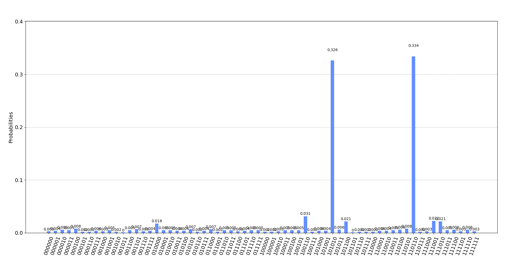

# Quantum Subset Sum

The code within this repository implements a quantum algorithm for solving the subset sum problem, which is stated as follows:

<i>Given a set of integers <b>X</b> = {<b>x<sub>1</sub></b>, <b>x<sub>2</sub></b>, ..., <b>x<sub>n</sub></b>} and a target sum <b>s</b>, determine those subsets whose elements add to <b>s</b>.</i>

Some authors are only concerned with whether or not such a subset exists, rather than its contents, but the code here tells us whether solutions exist and what those solutions are.

## Installation

After cloning the repository and navigating into the resulting directory, the module can be installed via the following command:

`pip install .`

Note that a local installation is necessary as the code hasn't been published to the [Python Package Index](https://pypi.org/). Following installation, the module can be imported like so:

`import qss`

## Execution

An example is provided below:

```
import qss

q = qss.QuantumSubsetSum([5, 7, 8, 9, 1], 16)
q.execute()
```

The output should look something like this:

```
[([7, 8, 1], 0.3525390625), ([7, 9], 0.3232421875)]
```

Where the first element of each tuple is a solution subset. The second element is the probability of measuring the corresponding subset state during execution of the underlying quantum circuit.

If you're interested in the raw measurements and their frequencies, these can be obtained via the `get_measurement_counts` function:

```
{'110000': 1, '000001': 3, '101001': 4, '100100': 2, '011111': 4, '010111': 2, '100011': 9, '000111': 2, '101000': 2, '001110': 3, '010100': 3, '011000': 4, '000110': 4, '100000': 3, '110101': 5, '010001': 6, '000100': 8, '001000': 4, '011110': 4, '100111': 5, '110011': 1, '111100': 10, '110111': 3, '001001': 3, '011001': 7, '111101': 7, '110010': 4, '010110': 6, '001111': 3, '010010': 8, '111000': 5, '111010': 19, '000101': 7, '010011': 5, '111110': 5, '011010': 3, '101010': 331, '001101': 5, '010101': 2, '001100': 3, '111011': 2, '010000': 15, '101111': 4, '100010': 3, '111111': 10, '011011': 3, '110110': 361, '001010': 2, '000010': 4, '101110': 4, '110100': 5, '011101': 5, '111001': 18, '100110': 17, '001011': 6, '101011': 4, '000000': 5, '000011': 4, '100101': 4, '100001': 3, '110001': 4, '011100': 3, '101101': 5, '101100': 18}
```

## Experimental Results

### Classical Simulation

Executing the code in the section above within a simulator and extracting the measurement counts provides us with the following probability distribution.



The histogram displays two clear peaks with measurements corresponding to states `110110` and `101010`. The leftmost qubit in these states represents the target sum which has been encoded with a negative phase. It is present in all solution states as the negative target sum value cancels out the sums of subsets which add to the target sum. If we ignore the qubit representing the target sum, each of the qubits read from right to left tells us which elements from the input set as included in the solution subset. A `1` indicates that the element is present while a `0` indicates that the element is not present. Reading the states using this procedure gives us `[7, 8, 1]` and `[7, 9]`, which are the correct solutions.

### IBM Quantum Computers

The same experiment was attempted using IBM's quantum computing infrastructure, but ultimately failed for input sets with cardinality greater than one. This was not due to a deficiency of the algorithm, but due to the fact that such sets require more than the 5 qubits included on IBMQ machines open to the public. If a quantum computer with at least 7 qubits was available, a non-trivial problem instance could have been executed. Although this is disappointing, the fortunate fact is that quantum computers are being built with more and more qubits as time progresses. With this comes a potential reduction in price, so it's possible that IBM will open up larger machines to the public in the future.

## Tests

Unit tests can be executed by running:

`python -m unittest qss/test_quantum_subset_sum.py`

## References

The implementation of this algorithm is based off concepts and techniques learned from the following resources:

Daskin, Ammar. "A quantum approach to subset-sum and similar problems." [arXiv preprint arXiv:1707.08730](https://arxiv.org/pdf/1707.08730) (2017).

Draper, Thomas G. "Addition on a quantum computer." [arXiv preprint quant-ph/0008033](https://arxiv.org/abs/quant-ph/0008033) (2000).

Gunter, David, and Toks Adedoyin. "Towards An Implementation of the Subset-sum Problem on the IBM Quantum Experience." [arXiv preprint arXiv:1912.03254](https://arxiv.org/pdf/1912.03254) (2019).

Qiskit.org. 2022. Grover's Algorithm. <https://qiskit.org/textbook/ch-algorithms/grover.html> [Accessed 28 February 2022].

Qiskit.org. 2022. Phase Kickback. <https://qiskit.org/textbook/ch-gates/phase-kickback.html> [Accessed 28 February 2022].

Qiskit.org. 2022. Quantum Fourier Transform. <https://qiskit.org/textbook/ch-algorithms/quantum-fourier-transform.html> [Accessed 28 February 2022].

Qiskit.org. 2022. Quantum Phase Estimation. <https://qiskit.org/textbook/ch-algorithms/quantum-phase-estimation.html> [Accessed 28 February 2022].

Zheng, Qilin, et al. "Quantum algorithm and experimental demonstration for the subset sum problem." Science China Information Sciences 65.8 (2022): 1-14.


## License

[MIT License](https://github.com/Qiskit/qiskit-terra/blob/main/LICENSE.txt)